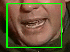
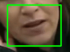
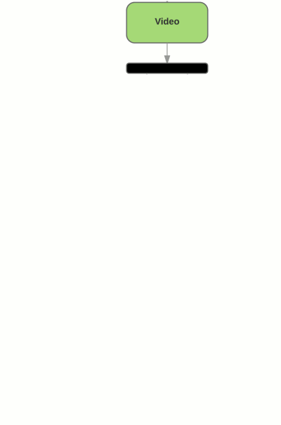
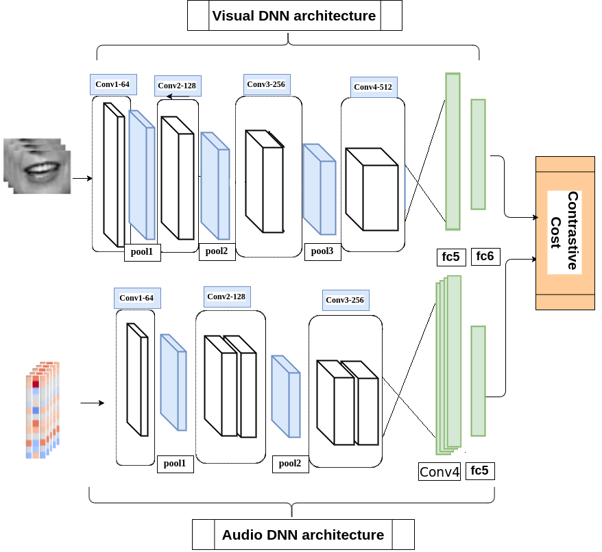
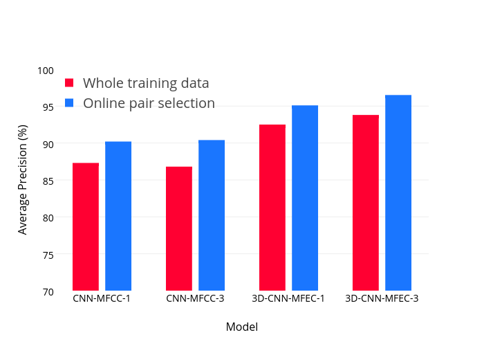
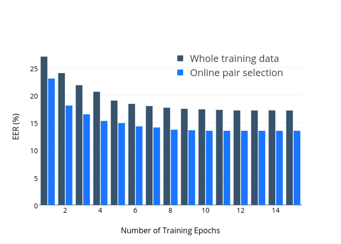

Lip Reading - Cross Audio-Visual Recognition using 3D Convolutional Neural Networks
===================================================================================


[](https://travis-ci.org/astorfi/lip-reading-deeplearning)
[](https://coveralls.io/github/astorfi/3D-convolutional-Audio-Visual?branch=master)
[](https://doi.org/10.5281/zenodo.840400)

This repository contains the code developed by
[TensorFlow](https://www.tensorflow.org/) for the following paper:

[Cross Audio-Visual Recognition in the Wild Using Deep
Learning](https://arxiv.org/abs/1706.05739)

by: [Amirsina Torfi](https://astorfi.github.io/), [Seyed Mehdi
Iranmanesh](http://community.wvu.edu/~seiranmanesh/), [Nasser M.
Nasrabadi](http://nassernasrabadi.wixsite.com/mysite) and Jeremy Dawson

 


The input pipeline must be prepared by the users. This code is aimed to
provide the implementation for **Coupled 3D Convolutional Neural
Networks** for audio-visual matching. **Lip-reading** can be a specific
application for this work.

If you used this code, please kindly consider citing the following
paper:


### DEMO

#### Training/Evaluation DEMO


#### Lip Tracking DEMO


### General View

*Audio-visual recognition* (AVR) has been considered as a solution for
speech recognition tasks when the audio is corrupted, as well as a
visual recognition method used for speaker verification in multi-speaker
scenarios. The approach of AVR systems is to leverage the extracted
information from one modality to improve the recognition ability of the
other modality by complementing the missing information.

#### The Problem and the Approach

The essential problem is to find the correspondence between the audio
and visual streams, which is the goal of this work. **We proposed the
utilization of a coupled 3D Convolutional Neural Network (CNN)
architecture that can map both modalities into a representation space to
evaluate the correspondence of audio-visual streams using the learned
multimodal features**.

#### How to leverage 3D Convolutional Neural Networks?

The proposed architecture will incorporate both spatial and temporal
information jointly to effectively find the correlation between temporal
information for different modalities. By using a relatively small
network architecture and much smaller dataset, our proposed method
surpasses the performance of the existing similar methods for
audio-visual matching which use CNNs for feature representation. We also
demonstrate that effective pair selection method can significantly
increase the performance.

### Code Implementation

The input pipeline must be provided by the user. The rest of the
implementation consider the dataset which contains the utterance-based
extracted features.

#### Lip Tracking

For lip tracking, the desired video must be fed as the input. At first,
cd to the corresponding directory:

```
cd code/lip_tracking
```

The run the dedicated `python file` as below:

```
python VisualizeLip.py --input input_video_file_name.ext --output output_video_file_name.ext
```

Running the aforementioned script extracts the lip motions by saving the
mouth area of each frame and create the output video with a rectangular
around the mouth area for better visualization.

The required `arguments` are defined by the following python script
which have been defined in the `VisualizeLip.py` file:

```
ap = argparse.ArgumentParser()
ap.add_argument("-i", "--input", required=True,
             help="path to input video file")
ap.add_argument("-o", "--output", required=True,
             help="path to output video file")
ap.add_argument("-f", "--fps", type=int, default=30,
             help="FPS of output video")
ap.add_argument("-c", "--codec", type=str, default="MJPG",
             help="codec of output video")
args = vars(ap.parse_args())
```

Some of the defined arguments have their default values and no further
action is required by them.

#### Processing

In the visual section, the videos are post-processed to have an equal
frame rate of 30 f/s. Then, face tracking and mouth area extraction are
performed on the videos using the ``dlib`` library. Finally, all
mouth areas are resized to have the same size and concatenated to form
the input feature cube. The dataset does not contain any audio files.
The audio files are extracted from videos using ``FFmpeg`` framework. The processing pipeline is the below figure.



#### Input Pipeline for this work

The proposed architecture utilizes two non-identical ConvNets which uses
a pair of speech and video streams. The network input is a pair of
features that represent lip movement and speech features extracted from
0.3 second of a video clip. The main task is to determine if a stream of
audio corresponds with a lip motion clip within the desired stream
duration. In the two next sub-sections, we are going to explain the
inputs for speech and visual streams.

**Speech Net**

On the time axis, the temporal features are non-overlapping 20ms windows
which are used for the generation of spectrum features that possess a
local characteristic. The input speech feature map, which is represented
as an image cube, corresponds to the spectrogram as well as the first
and second order derivatives of the MFEC features. These three channels
correspond to the image depth. Collectively from a 0.3 second clip, 15
temporal feature sets (each forms 40 MFEC features) can be derived which
form a speech feature cube. Each input feature map for a single audio
stream has the dimensionality of 15 × 40 × 3. This representation is
depicted in the following figure:


The **speech features** have been extracted using [SpeechPy](https://github.com/astorfi/speechpy).


**Visual Net**

The frame rate of each video clip used in this effort is 30 f/s.
Consequently, 9 successive image frames form the 0.3 second visual
stream. The input of the visual stream of the network is a cube of size
9x60x100, where 9 is the number of frames that represent the temporal
information. Each channel is a 60x100 gray-scale image of mouth region.


#### Architecture

The architecture is a **coupled 3D convolutional neural network** in
which *two different networks with different sets of weights must be
trained*. For the visual network, the lip motions spatial information
alongside the temporal information are incorporated jointly and will be
fused for exploiting the temporal correlation. For the audio network,
the extracted energy features are considered as a spatial dimension, and
the stacked audio frames form the temporal dimension. In the proposed 3D
CNN architecture, the convolutional operations are performed on
successive temporal frames for both audio-visual streams.



### Training / Evaluation

At first, clone the repository. Then, cd to the dedicated directory:

```
cd code/training_evaluation
```

Finally, the `train.py` file must be executed:

```
python train.py
```

For evaluation phase, a similar script must be executed:

```
python test.py
```

### Results

The below results demonstrate effects of the proposed method on the
accuracy and the speed of convergence.



The best results, which is the right-most one, belongs to our proposed
method.



The effect of proposed **Online Pair Selection** method has been shown
in the figure.

### Contribution

We are looking forward to your kind feedback. Please help us to improve
the code and make our work better. For contribution, please create the
pull request and we will investigate it promptly. Once again, we
appreciate your feedback and code inspections.
